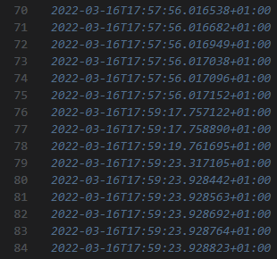
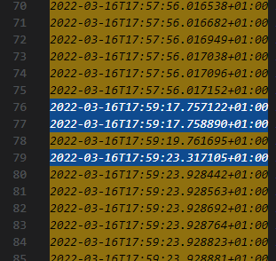
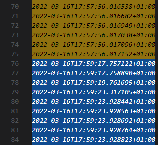

# Tava README

>WARNING: this extension is in alpha

T.A.V.A.

Timestamp Analysis Visual Aid - color codes groups of ISO 8601 timestamps based on target interval

## Features

separates timestamps into groups based on targeted interval which indicated when the new group has started and colors them in alternating pattern

For example, without plugin:

with plugin, 500ms target interval:

with plugin, 60000ms target interval:

> Tip: target interval can be set through command palette, just search for "tava"

## Requirements

- VSCode
- ISO 8601 timestamps

## Installation

`code --install-extension tava-x.x.x.vsix`

## Extension Settings

This extension contributes the following settings:

* `tava.targetInterval`: target interval in milliseconds

## Known Issues

I've never done anything in typescript and I've sacrificed my sleep to write this extension, so there are probably more _unknown_ issues than _known_

- doesn't know how to handle malformed lines
- minimap doesn't want to color timestamp portions
- codebase needs cleanup and improvement

## Release Notes

### 1.0.0

Initial release of T.A.V.A.

---

## Fun fact

_Tava_ translates to _pan_ in Croatian